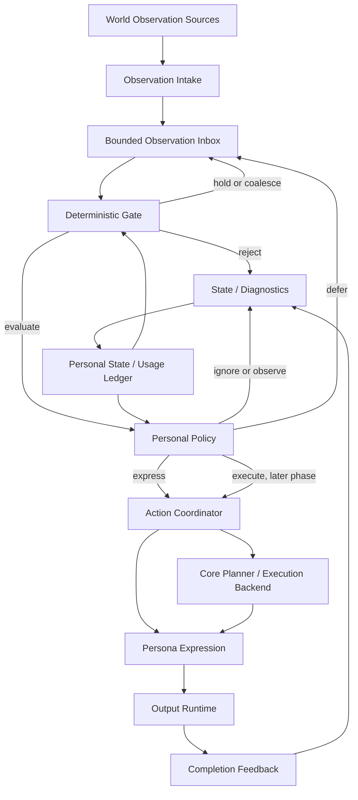

# 自主人格运行时实施计划

本文定义 Yakumo 如何从“能够主动投递消息”演进为“持续观察、谨慎判断、按需行动”的
自主人格运行时，并给出可直接进入开发的分批实施顺序。

本文是目标设计和实施依据，不代表所有能力已经实现。当前运行事实仍以源码、
`current-state.md` 和 `消息处理流程详解.md` 为准；每完成一个阶段，必须同步更新这些事实文档。

## 一、已经确认的设计结论

以下结论不再作为实现时的开放选择：

1. 官方 EventBus、Pipeline、权限过滤、平台 Adapter 和插件 Handler 继续作为唯一入站基础设施。
2. Personal Runtime 是持续控制层，不建立第二套 EventBus、消息队列、Conversation 或 Memory。
3. 普通、明确面向 Bot 的用户消息继续走现有 Router 与 Persona Expression 并发链路。
4. Personal Policy 只处理 Heartbeat、环境活动、计划任务、执行反馈和插件 Sensor 等内部
   Observation，不取代当前 Router。
5. Router 只判断普通入站消息是否需要 Core 候选路径；Personal Policy 与 Router 不共享模型
   决策、临时 Prompt 或执行状态。
6. Persona Expression 是唯一人格表达层。Policy、Router、Planner、Core 和插件都不直接生成
   最终人格文案。
7. Core Planner 与 Execution Backend 只负责工作判断和执行，不拥有持续人格状态。
8. Prompt 继续遵守 `Collectors -> ContextPack -> target projection -> Render Profile -> Renderer`。
9. Heartbeat tick 不等于模型调用；确定性 Gate 在任何后台模型调用之前执行。
10. 第一阶段只建立进程内跨 turn 状态，不承诺重启恢复。主动表达开放前，冷却、静音和预算
    必须具备重启安全的持久化。
11. 现有 `RuntimeObservationEvent` 和 `submit_runtime_observation_event()` 是“已决定输出后的平台
    适配入口”，不是通用 Observation Inbox，不能直接扩展成后台观察总线。
12. 初期主动策略只作用于用户明确配置的默认主动目标，不自动为所有历史会话创建 Heartbeat。

### 1.1 设计参考和非目标

`kawayiYokami/astrbot_plugin_angel_heart` 展示了跨消息在场状态、确定性规则优先、轻量模型参与
判断、回复与不回复使用不同冷却、突发消息合并和失败时保持安静等有效产品机制。Yakumo 学习
这些机制，但不复制它的插件架构、FrontDesk、Secretary、ConversationLedger、Prompt 重写、
图片缓存、主动管理器或锁与定时器体系。

本计划还明确不做：

- 不建立第二套 EventBus、Pipeline、Conversation、Memory、图片转述或 Cron。
- 不通过修改 `event.is_at_or_wake_command` 间接唤醒现有主链。
- 不让 Personal Policy 持有 ToolSet、Skills、知识库正文或 Core Executor。
- 不把 AG99live、Motion、Live2D 或其他平台领域协议写入通用 Runtime 契约。
- 不以兼容已经删除的内部过渡代码为理由保留双轨主链。

## 二、源码基线

### 2.1 已有能力

当前源码已经具备以下基础：

- `PersonalRuntimeManager` 在 Core 生命周期中单例存在，并被所有 Pipeline Scheduler 共享。
- `ProcessStage` 在官方过滤和预处理之后、插件 Handler 与 Core Agent 执行阶段管理
  Personal Runtime admission。
- `PersonalRuntimeKey` 已按 `config_id + persona_id + audience_key + privacy_scope` 隔离运行实例。
- `PersonalSessionRuntime` 已持有 session 级 turn lock、active turn 和 follow-up 协调器。
- `TurnExecutionScope` 已持有单 turn 的 Router、Persona、Context Material 和流式观察任务。
- `RuntimeObservation` 已是不可变内部事实，不伪装成用户消息。
- `submit_observation()` 已按 RuntimeKey 把内部事实写入有界 Inbox，并由单 Runtime 固定聚合窗口
  task 关闭为不可变 `ObservationBatch`；这一过程不产生模型调用或输出。
- Deterministic Gate 已从 batch 和 `PersonalState` 构建可验证 features，并返回稳定的
  `evaluate / hold / reject`、原因码与 diagnostics；不调用模型或输出。
- `RuntimeObservationEvent` 能把已经形成的主动表达适配到平台发送边界。
- `PersonalState` 已跨 turn 保留，并从真实物理投递回执接收一次 Completion Feedback。
- `InteractionOutputController` 已负责可见输出、最终输出仲裁、完成状态和规范记录。
- Persona Expression 已是即时回复、Core 结果和插件可见材料的统一人格表达入口。
- Prompt 已能从规范 `ContextPack` 投影 Router、Core Planner、Personal Policy、Persona 和 Core 视图。
- Shadow Personal Policy 已接入 Gate 的 `evaluate` 分支，使用独立 Provider、严格 tool-call
  `PersonalPolicyDecision` 和 fail-closed `observe`；当前只记录 diagnostics，不执行动作。
- 默认主动消息目标、Adapter 主动消息能力校验、Cron 和插件主动文本入口已经存在。

### 2.2 当前缺口

当前实现还不是持续人格运行时，主要缺口如下：

1. Gate settings 只接入了 Shadow Policy 每日调用上限；冷却、静音和主动预算仍是进程内字段，尚未达到开放主动
   表达所需的重启安全性。
2. 默认主动目标只回答“发到哪里”；Shadow Policy 已能判断人工 Observation，但其决策尚未进入
   Action Coordinator。
3. Heartbeat、Sensor 和 Action Coordinator 尚未接入，因此没有生产来源自动驱动 Inbox。
4. Shadow diagnostics 尚未积累真实模型和真实 Observation 数据，不能据此开放主动表达。

## 三、目标流程



普通用户消息不绕行上述后台 Policy：

```text
official EventBus / Pipeline
  -> Personal Runtime admission
  -> Router || Persona Expression
  -> optional Core Planner / Execution Backend
  -> Persona Expression
  -> Output Runtime
```

环境消息只有在后续阶段被只读转换为 `conversation_activity` Observation 时，才进入后台
Policy。明确唤醒、私聊和正常对话仍保留当前低延迟路径。

## 四、职责边界

### 4.1 Observation Source

Source 只报告“发生了什么”，不能决定是否回复，也不能直接调用 Persona 或 Core。

计划支持的来源：

- `heartbeat`
- `conversation_activity`
- `scheduled_task`
- `execution_progress`
- `execution_completed`
- `memory_commitment_due`
- `plugin_sensor`
- `presence_changed`

Source 必须提供结构化事实、目标会话和来源身份；不得把自由 Prompt、模型私有思考或最终文案
放入 Observation。

### 4.2 Personal Runtime

Personal Runtime 负责：

- 将平台事件或内部 Observation 解析到唯一 `PersonalRuntimeKey`。
- 持有跨 turn 的 `PersonalState`、Inbox 和 session 并发协调器。
- 管理 Runtime 的创建、复用、空闲保留、回收和关闭。
- 保证同一 Runtime 不创建平行的 Persona 最终输出任务。
- 将 Gate、Policy、Action 和 completion 连接为同一个运行实例的生命周期。

Personal Runtime 不拥有 Persona、Conversation、Memory、ToolSet、Provider 或平台连接本体。

### 4.3 Deterministic Gate

Gate 只做可以由代码确定的判断：

- 功能是否启用。
- Observation 是否过期、重复或缺少有效材料。
- Runtime 是否 muted、处于 quiet hours 或冷却期。
- Policy 调用和主动输出预算是否可用。
- 目标是否存在，后续表达时 Adapter 是否支持主动消息。
- 当前 Runtime 是否繁忙，是否应等待已有 turn 完成。
- 当前 batch 是否达到最小评估条件。

Gate 不理解人格语义，不判断“这句话是否有趣”，也不生成回复意图。

### 4.4 Personal Policy

Personal Policy 是后台人格行动决策器。它接收经过 Gate 的规范事实，输出严格结构化决策，
但不输出最终文案。

Policy 与现有模块的关系：

- Router：判断普通入站消息是否进入 Core 候选路径。
- Personal Policy：判断后台或环境 Observation 是否形成行动。
- Core Planner：判断一个明确任务是否值得执行并构造 `CoreTaskSpec`。
- Persona Expression：把待表达材料转换为最终人格表达。

### 4.5 Action Coordinator

Action Coordinator 将 Policy 决策转换为规范 Action Intent：

- `ignore`：消费并丢弃低价值 batch。
- `observe`：更新状态，保留事实影响，不产生输出。
- `defer`：保留规范 batch 与重新评估时间，不保存模型私有上下文。
- `express`：把 `reply_intent` 交给 Persona Expression。
- `execute`：后续阶段才允许进入 Core Planner。

它不能绕过现有 Output Runtime，也不能直接调用平台 Adapter。

### 4.6 Completion Feedback

Completion Feedback 来自真实输出或执行终态，不来自“已经开始发送”的推测。它负责：

- 只在最终输出确实 delivered 后更新 `last_expression_at`。
- 在 Policy Provider 调用开始时计入模型预算。
- 只在主动可见输出成功完成后计入主动输出预算。
- 记录失败、取消、抑制和目标不可用的稳定 failure code。
- 后续把用户 follow-up 与最近 action 关联，但不复制 Conversation 历史。

## 五、核心数据契约

以下为语义契约，具体 Python 类型在实现阶段使用 dataclass、Enum 和只读 Mapping 表达。

### 5.1 RuntimeObservation

保留现有字段，并补充 Inbox 所需的稳定身份和生命周期信息：

```text
observation_id
kind
source
occurred_at
expires_at
coalesce_key
target_session
correlation_id
payload
```

约束：

- `observation_id` 在 Observation 创建时生成，提交后保持稳定；重复提交同一 ID 只替换待处理项。
- `coalesce_key` 只用于同类事实替换，不作为 Runtime 身份。
- `expires_at` 到期后在 Inbox admission 或 batch close 时丢弃，不等待模型 Gate。
- payload 必须保持不可变，不能放 event、ProviderRequest、ToolSet 或可变运行对象。
- `visible_reply_material` 只用于已决定表达的兼容路径，不是所有 Observation 的必填字段。

### 5.2 PersonalState

`PersonalState` 属于 `PersonalSessionRuntime`，不放入 `InteractionTurnState`，也不以 event extra
作为主存储。

建议字段：

```text
attention_state
availability_state
last_observation_at
last_user_activity_at
last_expression_at
reply_cooldown_until
no_action_cooldown_until
mute_until
pending_observation_count
usage_day
daily_policy_calls
daily_proactive_outputs
last_gate_reason
last_policy_action
```

字段分层：

| 状态 | 第一阶段 | 主动表达开放前 |
| --- | --- | --- |
| attention / availability / pending count | 进程内 | 进程内 |
| last observation / user activity | 进程内 | 可重建或持久化 |
| last expression / cooldown / mute | 进程内 | 必须持久化 |
| daily policy calls / proactive outputs | 进程内诊断 | 必须持久化 |

话题、关系、承诺内容和长期人格事实继续属于 Conversation / Memory，不写入 PersonalState。

### 5.3 ObservationBatch

```text
batch_id
runtime_key
opened_at
closed_at
observations
source_counts
latest_occurred_at
```

Batch 只包含同一 `PersonalRuntimeKey` 的 Observation。不同 audience 或 privacy scope 永远不能
合并。

### 5.4 ObservationFeatures

Feature Builder 只生成可验证事实：

```text
is_explicitly_summoned
is_follow_up_candidate
message_count
participant_count
echo_count
activity_density
seconds_since_user_activity
seconds_since_last_expression
has_pending_commitment
is_runtime_busy
is_quiet_hours
is_muted
budget_available
target_available
```

Feature 不包含模型判断、回复文案或隐藏推理。

### 5.5 PersonalPolicyDecision

```json
{
  "action": "ignore | observe | express | defer | execute",
  "reason_code": "stable_reason_code",
  "reply_intent": "",
  "task_intent": "",
  "importance": 0.0,
  "defer_seconds": 0
}
```

约束：

- `importance` 必须是 `0.0` 到 `1.0` 的 number。
- `reason_code` 使用稳定枚举，不接受自由解释替代原因码。
- 非 `express` 时 `reply_intent` 必须为空。
- 非 `execute` 时 `task_intent` 必须为空。
- 第一至第五阶段拒绝执行 `execute`，即使模型返回该值。
- 使用 OutputContract / tool call 生成并校验，不手工解析自由文本 JSON。

### 5.6 ActionIntent

```text
action_id
runtime_key
source_batch_id
action
reply_intent
task_intent
created_at
not_before
```

ActionIntent 是 Policy 与 Persona / Planner 之间的唯一业务材料，不携带 Provider 私有消息或
模型 reasoning。

### 5.7 CompletionFeedback

```text
action_id
turn_id
delivery_status
execution_status
output_completed_at
failure_code
user_follow_up_observed
```

## 六、Runtime 身份和生命周期

### 6.1 身份

继续使用现有 `PersonalRuntimeKey`：

```text
config_id + persona_id + audience_key + privacy_scope
```

actor、message_id、conversation_id 和 turn_id 是单轮事实，不加入 Runtime 主键。后台 Source
也不能自行拼装主键；它提交目标信息，由 `PersonalRuntimeManager` 使用与平台事件相同的人格和
隐私规则解析。

### 6.2 进程内保留

当前 `_settle()` 在 Runtime 空闲时立即删除实例，需要改为：

- active turn、follow-up、pending observation 或 deferred batch 存在时绝不回收。
- 空闲 Runtime 初期保留 24 小时。
- 最多保留 1024 个空闲 Runtime。
- 在 bind、settle 和 shutdown 时惰性执行 TTL / LRU 回收，不增加独立清理线程。
- 被回收的进程内状态不伪装成持久状态；回收 reason 写入 diagnostics。

这些值先作为内部安全边界，不增加用户配置。真实使用数据表明需要调整时，再决定是否暴露。

### 6.3 重启持久化

第一阶段不写数据库。第四阶段启用主动表达前，增加窄化的 State Repository，只持久化：

- `last_expression_at`
- `reply_cooldown_until`
- `no_action_cooldown_until`
- `mute_until`
- `usage_day`
- `daily_policy_calls`
- `daily_proactive_outputs`

Inbox、active turn、模型临时上下文和短期 attention 不持久化。启动后可以重新观察世界，不能恢复
到一个伪造的进行中 turn。

## 七、Inbox、合并和 Gate 规则

### 7.1 通用提交边界

新增内部 `submit_observation()`，职责仅为：

1. 校验 Observation。
2. 解析 `PersonalRuntimeKey`。
3. 写入对应 Runtime Inbox。
4. 触发或复用该 Runtime 的 batch evaluation task。
5. 返回结构化 admission result。

它不创建 `AstrMessageEvent`，不进入 EventBus，不要求平台支持主动消息，也不直接取得最终输出
turn lease。只有 Policy 已决定 `express` 时，Action Coordinator 才使用现有 observation event
适配能力进入 Persona 与 Output。

### 7.2 有界队列

初始边界：

- 每个 Runtime 最多 64 条待处理 Observation。
- 默认固定聚合窗口 1.5 秒；窗口内的新事实不延长截止时间，避免持续输入造成 batch 饥饿。
- 同一 `kind + source + coalesce_key` 保留最新事实。
- 入队前先删除过期项，再处理容量限制。
- 容量仍满时丢弃最旧项并记录 `inbox_overflow_drop_oldest`。
- 明确面向 Bot 的普通用户消息不进入该队列，因此不会因队列溢出丢失直接请求。

### 7.3 Gate 结果

Gate 返回：

```text
evaluate
hold
reject
```

Inbox admission 当前已经使用：

```text
observation_expired
inbox_expired_removed
inbox_duplicate_replaced
inbox_coalesced_replaced
inbox_overflow_drop_oldest
```

Deterministic Gate 当前使用：

```text
accepted
feature_disabled
observation_expired
missing_material
runtime_busy
muted
quiet_hours
reply_cooldown
no_action_cooldown
policy_budget_exhausted
output_budget_exhausted
target_unavailable
```

Phase 2 只记录 Gate 结果，不改变当前回复和发送行为。`hold` 会把 batch 原样恢复到 Inbox；
Runtime busy 在当前 turn settle 后重新评估，quiet hours 与 cooldown 等待后续 Observation 唤醒，
不建立第二套调度器。

## 八、Prompt 与模型边界

### 8.1 收集和投影

Phase 3 已增加 `personal_policy` target，且没有建立私有 Prompt Builder：

```text
Collectors
  -> canonical ContextPack
  -> personal_policy projection
  -> Personal Policy Render Profile
  -> Provider Renderer
```

新增规范槽位：

```text
runtime.personal_state
runtime.observation_batch
runtime.observation_features
```

Prompt Context 类型和 Catalog 增加明确的 `runtime` 类别。Collector 只收集事实，Projection
决定 Policy 能看见哪些槽，Render Profile 定义策略指令和输出契约。

现有 Collector 接口仍接收 `AstrMessageEvent`。Phase 3 增加一个只读的 Policy Prompt 收集
适配器，把 Runtime identity、目标会话和 Observation batch 投影为 Collector 可读取的上下文；
该适配器不具备平台发送能力，不进入 EventBus，不设置 wake，也不会写入 Conversation。不能复用
面向主动输出的 `RuntimeObservationEvent.send()` 来伪装用户输入。

### 8.2 Policy 可见内容

Policy 初期可见：

- 简要 Persona 身份和行为边界。
- PersonalState 的只读投影。
- ObservationFeatures。
- 当前 Observation batch。
- 最近有限对话窗口。
- 必要的 Memory 摘要。
- 当前时间和目标会话类型。

Policy 不接收：

- 完整工具 schema。
- Skills、知识库正文或 Core Execution Ledger 全量记录。
- Motion、Live2D 或具体插件 effect schema。
- Router、Planner 的临时决策。
- 已失败、已取消或已过期的 Prompt 痕迹。
- Provider reasoning 或模型私有上下文。

### 8.3 模型调用规则

- 只有 Gate 返回 `evaluate` 才能调用 Policy Provider。
- Provider 未配置、不可用、超时、解析失败或 schema 不合法时统一 fail closed 为 `observe`。
- Policy 调用与 Persona、Core 使用独立 provider 配置和预算。
- Phase 3 只运行 shadow policy，不执行任何决策。
- diagnostics 不记录完整 Persona Prompt、Memory 正文或私密对话，只记录槽位摘要和原因码。

## 九、并发和取消模型

1. 一个 `PersonalRuntimeKey` 同时最多有一个 active conversational turn。
2. Inbox 写入不等待 active turn 完成；evaluation 在 Runtime 繁忙时标记 hold。
3. 每个 Runtime 同时最多有一个 batch evaluation task，新观察只唤醒或扩展现有 task。
4. Policy 不能与同一 Runtime 的最终 Persona output task 并行争夺完成权。
5. `express` 必须先通过现有 turn admission，再进入 Persona Expression 和 Output Runtime。
6. Core 提前完成、Policy 取消、目标失效和进程 shutdown 都必须形成稳定终态。
7. shutdown 顺序为：停止新 Observation admission、取消未开始的 evaluation、等待或取消 active
   action、刷新持久 usage state、释放 Runtime。

## 十、实施阶段

### Phase 0：计划和基线确认

目标：锁定边界，避免实现中隐式决定生命周期。

工作：

- 以本文替换初期概念草案。
- 记录现有 Runtime 删除、主动输出适配和 Prompt target 基线。
- 确认第一批不修改 Router、Planner、Persona、Cron、Dashboard 和平台 Adapter。

验收：

- 文档与源码不存在“现有 Runtime 已跨 turn 持续”的错误描述。
- 通用 Observation 与已决定主动输出的适配入口被明确区分。

### Phase 1A：状态契约和 Runtime 生命周期

状态：已实现。当前实现只提供进程内状态和受限空闲保留，未提前包含 Phase 1B 或 Phase 2
能力。

目标：建立进程内跨 turn 的持续状态，不改变回复行为。

工作：

- 新建 Personal State 契约模块，定义 `PersonalState` 和 `CompletionFeedback`。
- 扩展 `PersonalSessionRuntime`，持有 state、last access 和空闲生命周期信息。
- 将立即删除改为 TTL / LRU 惰性回收。
- 增加 Manager shutdown 和只读 diagnostics snapshot。
- turn admission 只更新 `last_user_activity_at` 等运行事实。

明确不做：

- 不创建 Inbox。
- 不增加模型调用。
- 不增加配置或 WebUI。
- 不持久化数据库。

验收：

- 同一 RuntimeKey 的连续两个 turn 复用同一进程内 state。
- 不同 persona、audience 和 privacy scope 状态严格隔离。
- active / pending Runtime 不会被回收。
- 原有平台消息、插件、Cron 和主动输出行为不变。

### Phase 1B：Completion Feedback

状态：已实现。当前反馈覆盖现有 turn 的真实投递与终态，不提前引入 Action Coordinator、主动
预算或持久化。

目标：用真实终态更新状态，不从发送意图猜测完成。

工作：

- 从现有 final output status、turn material 和 lease release 形成 CompletionFeedback。
- delivered、failed、cancelled、suppressed 分别记录稳定终态。
- 只有 delivered 可见表达更新 `last_expression_at`。
- diagnostics 关联 runtime key、turn id、action id 和 completion status。

实现边界：

- `InteractionTurnCompletionState` 保存 terminal timestamp。
- lease release 在关闭 turn task 后读取规范 `InteractionUtterance` 投递回执和 turn 终态，并且
  只应用一次反馈。
- 即时表达已经送达、后续 turn 又失败时，delivery 仍为 delivered，同时保留 execution failure
  和 failure code。
- 当前尚无 Action Coordinator，因此 `action_id` 保持空值，主动输出成功预算不递增。

验收：

- 发送失败不会消耗主动输出成功预算。
- 被抑制的重复输出不会更新 last expression。
- 不增加第二套 lifecycle observer 或 output callback。

### Phase 2A：Observation Intake 与 Inbox

状态：已完成。

目标：接收和合并内部事实，但不改变行为。

工作：

- 扩展 RuntimeObservation 的 inbox 字段。
- 定义 ObservationBatch 和 admission result。
- 新增 `submit_observation()`，与现有主动输出 submission 分离。
- 为 Runtime 增加有界 Inbox、固定聚合窗口、coalesce、expiry 和 overflow。
- 增加单 Runtime evaluation task 所有权。

验收：

- Observation admission 不构造用户消息、不进入 EventBus。
- 不支持主动消息的目标也可以被观察，但不能执行 express。
- 高频同类观察不会线性创建 task。
- 当前普通消息行为完全不变。

### Phase 2B：Deterministic Gate

状态：已完成。

目标：完成模型调用前的确定性成本和打扰控制。

工作：

- 定义 ObservationFeatures、Gate result 和 reason code。
- 实现 expiry、busy、mute、quiet hours、cooldown、budget 和 target capability 检查。
- 仅输出结构化 diagnostics，不调用模型。
- 用现有主动输出和人工提交的 observation 做边界验证，不接环境群聊。

验收：

- 每个 reject / hold 都有稳定原因码。
- Gate 计算不修改 event wake 状态。
- Gate 不阻塞官方 Pipeline。
- Gate 只读取 batch、PersonalState、Runtime 忙闲与目标能力，不持有 event、Provider 或 ToolSet。
- hold batch 不丢失；busy hold 会在现有 turn settle 边界重新评估。

### Phase 3：Shadow Personal Policy

状态：已实现。默认关闭；当前只评估和记录，不执行 Action。

目标：验证小模型决策质量，不执行动作。

工作：

- 增加 `PromptTarget.PERSONAL_POLICY`。
- 增加 runtime Context slots、Collector、Catalog 和 Policy Render Profile。
- 增加只读 Policy Prompt 收集适配器，兼容现有 Collector 接口但不构造用户消息。
- 定义严格 PersonalPolicyDecision output contract。
- 增加独立 provider、timeout、temperature 和每日调用预算配置。
- shadow 模式记录 Gate features、Policy decision 和后续事实对照。
- Provider 必须显式选择，不继承 Persona 或 Core Provider；不支持协议级 tool-call 时不会发起
  模型请求。
- Provider 请求开始时才计入进程内每日调用预算；调用期间新增 Observation 顺序进入下一批。

验收：

- Gate 拒绝时零模型调用。
- Policy 不接收工具、Skills 或 effect schema。
- schema 错误、超时和 provider 错误统一 fail closed。
- shadow 模式不发送消息、不调用 Core、不修改 Router。

### Phase 4：单目标 Heartbeat Express

目标：让配置目标具备受控的主动人格表达能力。

前置条件：

- 冷却、静音和每日预算已持久化。
- shadow policy 日志稳定。
- 默认主动目标可用并支持主动消息。

工作：

- 增加本地 Heartbeat Source；tick 只提交 Observation。
- 初期只针对 `platform_settings.proactive_message_target` 创建实例。
- quiet hours 使用显式 IANA timezone；未配置时使用主机时区。
- 开放 `ignore / observe / express / defer`，继续禁止 `execute`。
- `express` 经 ActionIntent、Persona Expression 和 Output Runtime 投递。
- `defer` 只保留 batch 与 `not_before`，由后续 Heartbeat 或新观察重新评估，不建立第二套
  定时任务系统。

建议配置：

```text
enable
interval
policy_provider_id
quiet_hours
timezone
reply_cooldown
no_action_cooldown
max_policy_calls_per_day
max_proactive_outputs_per_day
```

验收：

- Heartbeat tick 在 Gate 不通过时零模型调用。
- 未配置目标、目标不可用、静音、安静时段或预算耗尽时零输出。
- 一次 action 最多产生一个最终可见输出。
- 重启后不会因预算和冷却丢失连续打扰用户。

### Phase 5：环境对话 Observation

目标：让人格可以谨慎参与未明确唤醒的环境对话。

工作：

- 在官方过滤和预处理之后、插件 Handler / Core Agent 之前增加只读 observation tap。
- 只把符合配置范围的非唤醒群聊文本转换为 `conversation_activity`。
- 排除 Notice、平台控制、空内容、已停止和协议事件。
- Feature Builder 计算参与人数、复读、密度、连续追问候选和最近表达时间。
- Policy 只允许 express / observe / ignore / defer，不允许环境消息直接进入 Core。

验收：

- 功能关闭时与当前官方行为完全一致。
- tap 不修改 `event.is_at_or_wake_command`、`event.is_wake` 或插件激活结果。
- 同一 burst 最多形成一次 Policy 判断和一次 Persona 表达。
- 明确唤醒仍走当前 Router / Persona 低延迟路径。

### Phase 6：插件 Sensor API

目标：允许插件贡献世界事实，而不是绕过控制层主动发文案。

工作：

- 提供结构化 Sensor 注册和 Observation 提交 API。
- 插件声明 source id、支持的 kind、目标范围和 payload schema。
- 复用 Runtime 身份解析、Inbox、Gate、Policy 和 diagnostics。
- 保留官方 `Context.send_message()` 兼容入口；它仍代表插件已经决定发送，不伪装成 Sensor。

验收：

- 插件不能通过 Sensor 绕过 Policy、Persona 或 Output。
- payload 不允许携带 event、ProviderRequest、ToolSet 或平台连接对象。
- 插件卸载后清理 Sensor 注册和未处理来源引用。

### Phase 7：受控 Execute

目标：在主动表达稳定后，允许 Policy 按需发起 Core 工作。

工作：

- 开放 `execute` 并转换为 Core Planner 输入。
- Planner 独立判断 execute / not_required，不能直接信任 Policy。
- Execution Backend 返回进度、结果或错误材料。
- 所有用户可见结果继续经 Persona Expression 和 Output Runtime。
- Core 错误形成 CompletionFeedback，并由 Persona 使用已配置兜底 Provider 表达。

验收：

- Policy 不能直接调用 ToolSet。
- Planner 拒绝后不会启动执行器。
- 同一 action 的进度和最终结果共享 identity，不重复完成。
- Native、Claude Code、OpenCode 等 Backend 使用同一 Action / Execution 边界。

## 十一、模块改动矩阵

| 模块 | Phase | 计划改动 | 不应承担的职责 |
| --- | --- | --- | --- |
| `interaction/personal_runtime.py` | 1-2 | Runtime 保留、state、Inbox、evaluation 所有权 | Prompt 拼装、人格文案 |
| `interaction/observation.py`、`interaction/observation_inbox.py` | 2 | Observation / Batch / admission / Inbox 契约 | 平台发送、模型决策 |
| 新的 Personal State 模块 | 1 | State、Feedback 类型 | Conversation / Memory |
| 新的 Personal Policy 模块 | 2-3 | Gate、Features、Decision、shadow policy | Router、Planner、Tool loop |
| `interaction/turn_state.py` | 1 | 只提供 completion 事实读取 | 持续状态主存储 |
| `interaction/middleware.py` | 1、4、7 | 复用 Persona / Output action 边界 | Observation Inbox |
| `pipeline/process_stage/stage.py` | 5 | 官方过滤后的只读环境观察 tap | 新 Pipeline、wake 改写 |
| `prompt/context_types.py`、Catalog | 3 | runtime 类别和规范槽 | Policy 私有数据管线 |
| `prompt/targets.py` | 3 | `personal_policy` projection | 模型决策 |
| Prompt collectors / render profile | 3 | 收集运行事实并渲染 Policy | 直接查询业务数据 |
| 只读 Policy Prompt 适配器 | 3 | 将 Runtime facts 接入现有 Collector 接口 | EventBus、平台发送、Conversation 写入 |
| `core_lifecycle.py` | 1、4 | Runtime shutdown、Heartbeat service 生命周期 | 第二套 EventBus |
| `cron` | 暂不修改 | 保留现有任务能力 | 承担短期 defer 私有调度器 |
| config / Dashboard / i18n | 3-4 | Policy 与 Heartbeat 配置 | Phase 1 提前暴露空配置 |
| Conversation / Memory | 不改主存储 | 继续提供语义历史与记忆 | Runtime 冷却和预算 |

## 十二、验证策略

遵守项目的基础输入输出测试原则，不建立大量 mock 或实现细节测试。

每阶段最低验证：

- Python import / compile 和 Ruff。
- 一个公开边界的最小输入输出检查。
- `git diff --check`。
- 文档阶段运行 VitePress build 和 Mermaid 校验。

重点场景：

1. 同一 RuntimeKey 跨 turn 状态延续，不同 key 严格隔离。
2. 高频 Observation 合并后只形成一个 batch evaluation。
3. Gate 拒绝时没有 Provider、Persona、Core 或平台调用。
4. shadow policy 永远不产生可见输出。
5. 主动表达只在真实 delivered 后更新预算和 last expression。
6. 平台消息、插件 Handler、明确唤醒和现有主动发送兼容行为不回归。

不测试私有方法调用次数、内部锁获取顺序、临时 task 名称或 mock 出来的模型语义。

## 十三、提交和回滚边界

按 Phase 1A、1B、2A、2B、3、4、5、6、7 分批提交，不把状态生命周期、模型 Policy 和主动
输出混在一个提交中。

每批要求：

- 新 owner 建立后删除被替代的内部写路径，不保留长期双轨兼容壳。
- 官方公开 Hook、插件 Handler 和 Adapter 接口保持稳定。
- feature flag 关闭时，尚未正式开放的后台能力必须零行为差异。
- 阶段验证失败时只回退当前阶段，不依赖后续阶段补救前一阶段缺陷。

## 十四、当前建议的下一批工作

Phase 1A、Phase 1B、Phase 2A、Phase 2B 和 Phase 3 已完成：

1. `PersonalState` 已由保留的 `PersonalSessionRuntime` 跨 turn 持有。
2. 空闲 Runtime 已具有受限 TTL / LRU 生命周期、shutdown 和只读 diagnostics。
3. admission 记录用户活动和忙闲事实。
4. lease release 已把真实投递回执和 turn 终态转换为一次 `CompletionFeedback`。
5. 只有 delivered 可见输出更新 `last_expression_at`；主动预算保持不变。
6. 通用 `submit_observation()` 已与主动输出 submission 分离，并复用官方人格和隐私解析规则。
7. 每个 Runtime 已拥有 64 条上限、1.5 秒固定聚合窗口、显式 coalesce、expiry、overflow
   和唯一 evaluation task。
8. batch 已进入确定性 Feature Builder 与 Gate；Gate 只生成 `evaluate / hold / reject`、稳定原因
   和 diagnostics，不调用模型或输出，hold batch 不会丢失。
9. `evaluate` batch 已可进入默认关闭的 Shadow Personal Policy；独立 Provider、严格 tool-call、
   timeout、temperature、每日预算和 fail-closed diagnostics 已接线。
10. Policy 只读取受限 Prompt 投影，不取得 ToolSet、Skills、知识库、effect、Router 或 Planner
    临时状态；所有 action 都不执行。

下一次代码实施应先完成 Phase 4 的前置条件：确定持久状态边界，接入 quiet hours、mute、cooldown
和主动输出预算配置，并用真实 shadow diagnostics 验证策略质量。满足这些条件后，再增加只提交
Observation 的单目标 Heartbeat Source；不能直接从当前 shadow decision 跳到主动发送。

## 十五、后续仍需用运行数据决定的问题

以下问题不阻塞已完成阶段，但必须在对应阶段前确认：

- 哪些模型在严格 tool-call 下能稳定满足 Policy schema，以及 shadow decision 的误触发率。
- Phase 4 quiet hours 的默认时间段，不在代码里隐式假设。
- Phase 5 哪些群聊和 Adapter 默认允许环境观察，默认应关闭。
- Phase 6 Sensor payload 的公共版本化和权限模型。
- Phase 7 主动 execute 的用户确认、风险等级和工具权限策略。
- 24 小时 / 1024 Runtime、64 Observation 和 1.5 秒聚合窗口是否需要根据真实 diagnostics 调整。
